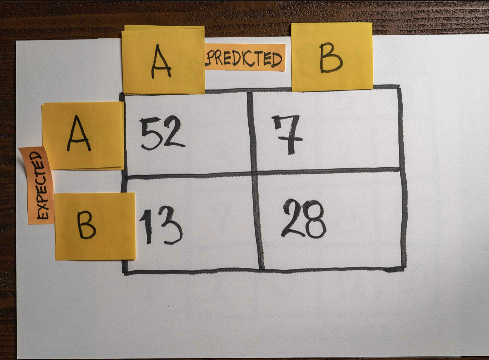

# The model's recall

A team built a binary classification model. They named the classes A and B.

After finishing training, they evaluated the model on a validation set, and here is the confusion matrix with the results:

Given the above confusion matrix, what of the following correctly represents the model's recall predicting classes A and B, respectively?

- The model's recall predicting class A is 80%, and class B is 80%.

- The model's recall predicting class A is 88%, and class B is 68%.

- The model's recall predicting class A is 88%, and class B is 88%.

- The model's recall predicting class A is 68%, and class B is 88%.

# Answer 

# Recommended Reading

1. [How to Calculate Precision, Recall, and F-Measure for Imbalanced Classification](https://machinelearningmastery.com/precision-recall-and-f-measure-for-imbalanced-classification/)

