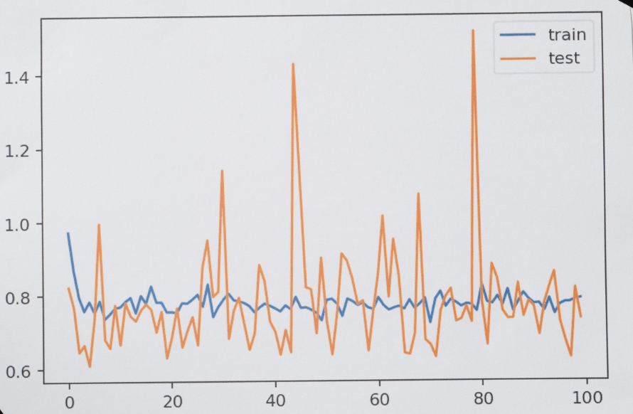

## Effect of Batch Size

Lena ran two experiments training a neural network on a sample dataset. Her goal is to understand how different batch sizes affect the training process.

One of the experiments used a very small batch size, and the other used a batch size equal to all existing training data.

After training and evaluating her models, Lena plotted the training and testing losses over 100 epochs of one of the experiments, and this is what she got:

## Attempt

## Which of the following options is the most likely to be true?

1. The model behind this plot corresponds to the experiment that used a very small batch size. This model was the one that took less time to train.

2. The model behind this plot corresponds to the experiment that used a very small batch size. This model was the one that took longer to train.

3. The model behind this plot corresponds to the experiment that used a batch size equal to all the available training data. This model was the one that took less time to train.

4. The model behind this plot corresponds to the experiment that used a batch size equal to all the available training data. This model was the one that took longer to train.

## Recommended reading

1. Check ["What is the Curse of Dimensionality?"](https://deepai.org/machine-learning-glossary-and-terms/curse-of-dimensionality) for an introduction to the Curse of Dimensionality.

2. For an explanation of data leakages, check ["Data Leakage in Machine Learning"](https://machinelearningmastery.com/data-leakage-machine-learning/).

2. ["Introduction to Dimensionality Reduction for Machine Learning"](https://machinelearningmastery.com/dimensionality-reduction-for-machine-learning/) covers different examples of dimensionality reduction.

